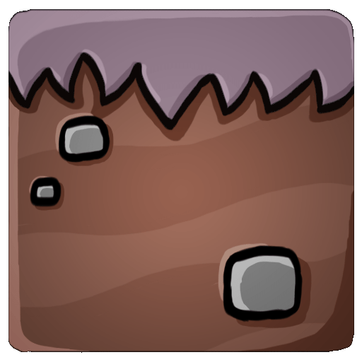

<div align="center">

</div>

<h1 align="center">DexCraft Launcher</h1>
<p align=center><i align="center">Minecraft Launcher reinventado</i></p>
<div align="center">

<a href="https://www.w3.org/Style/CSS/Overview.en.html"></a>&nbsp;
<a href="https://www.javascript.com"></a>&nbsp;
<a href="https://nextjs.org"></a>&nbsp;
<a href="https://reactjs.org"></a>&nbsp;
<br>
<a href="https://react-hook-form.com"></a>&nbsp;
<a href="https://www.electronjs.org/pt/"></a>&nbsp;
<a href="https://github.com/saltyshiomix/nextron"></a>&nbsp;
<a href="https://www.electron.build"></a>&nbsp;
<br>
<a href="https://nodejs.org/en/"></a>&nbsp;
<a href="https://www.prisma.io"></a>&nbsp;
<a href="https://www.docker.com"></a>&nbsp;
<a href="https://chakra-ui.com"></a>&nbsp;
<br>
<a href=""></a>&nbsp;
<a href=""></a>&nbsp;
<a href=""></a>&nbsp;
<br>
<a href=""></a>&nbsp;
<a href=""></a>&nbsp;
<a href="https://github.com/dexdevlab/dexcraft-launcher/blob/main/LICENSE"></a>&nbsp;

</div>

## Conteúdo

Inicialmente este projeto começou como um simples hobby, com a finalidade de atender a necessidades de um servidor privado de Minecraft. Agora, ele é um projeto ambicioso, de melhoria contínua que pretende entregar um launcher de Minecraft que possa ser usado por todos.

## Características

- Nova versão em Electron: diferente das versões anteriores do DexCraft Launcher, esse usa um framework mais fácil, manitenível e escalável, se utilizando de Electron e ferramentas análogas
- Perfil de usuário: faça um simples cadastro e um login e tenha acesso a customização e configurações em qualquer lugar
- Instalação fácil de instâncias: instalar uma instância Minecraft local ou para um servidor é simples e intuitivo, incluindo a exclusão da instância e a restauração de arquivos sem perda dos dados locais
- Configuração sem rodeios: configurar as instâncias de Minecraft é simples e fácil
- Design novo e interessante: uma interface acolhedora, divertida e focada em uma experiência inovadora

### Roadmap

Features a serem implementadas:

- Atualização automática
- Troca de senha
- Multi perfis sem necessidade de logoff
- Permitir configuração customizada JVM da instância
- Skins e capas personalizadas
- Salvamento de configurações e opções via nuvem através da conta de usuário
- Permitir instâncias personalizadas (versões de Minecraft)
- Permitir selecionar mods para votação do DexCraft Seasons, ao invés de tags
- Loja de mods
- Importação de mundos de instâncias externas (outros launchers)
- Backup de mundos locais
- Suporte ao idioma inglês
- Permitir contas Microsoft realizar login nos servidores DexCraft

Importante enfatizar que o Roadmap é uma proposta de entrega de feature, e não uma promessa.

## Documentação

- [Perguntas Frequentes](https://github.com/DexDevLab/dexcraft-launcher/blob/main/FAQ.md)
- [Notas de Versão](https://github.com/DexDevLab/dexcraft-launcher/blob/main/CHANGELOG.md)
- [Notas para Contribuidores](https://github.com/DexDevLab/dexcraft-launcher/blob/main/CONTRIBUTORS.md)
- [Esquema de UML para Banco de Dados]()

Documentação das versões legado do DexCraft Launcher pode ser encontrada [aqui](https://github.com/DexDevLab/DexCraftLauncherClient/).

## Instruções

### Utilizando o repositório como projeto

1 - Faça um git clone ou o download do repositório, da forma que preferir

```bash
git clone https://github.com/dexdevlab/dexcraft-launcher.git
```

## Autores

<a href="https://github.com/dexdevlab/dexcraft-launcher/graphs/contributors">
  
</a>

## Contato

Se você gostou deste projeto, dê uma <a href="https://github.com/dexdevlab/dexcraft-launcher" data-icon="octicon-star" aria-label="Star dexdevlab/dexcraft-launcher on GitHub">estrela</a>. <br>
Para contato, envie um email a: <a href="mailto:dex.houshi@hotmail.com">dex.houshi@hotmail.com</a>

## Licença

Licenciado sob a [MIT License](https://github.com/dexdevlab/dexcraft-launcher/blob/main/LICENSE).
